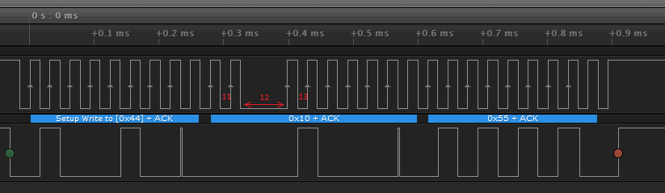

# I2C-tool
ESP8266 firmware implementing an I2C slave with spy, loop-back and configurable clock stretch injector.


## Introduction
This I2C-tool is an ESP8266 project implementing an I2C slave with the following features
 - spy: echos all traffic to UART
 - loop-back: write bytes, read back
 - clock stretch injector: can stretch any clock pulse

The I2C-tool uses interrupts to track two pins, one for SCL and one for SDA.
Unfortunately, the ESP8266 has high interrupt latency: on 160MHz, the interrupt latency is ~4.3us. 
Note that slowest I2C has a clock of 100kHz, so interrupts come every 5us, which is tight.
As a result it is recommended to use an I2C clock of e.g. 32kHz.


## Spy 
The I2C-tool can be added to an I2C bus, and any transaction it sees is echoed over serial.
This is the spy feature.


Find below an example where some master sends a ping to device with slave address 0x86.
This consists of a START condition `s`, the `86` slave address and a STOP `p`. 
Note the `a` after `86`, which is the acknowledge of the slave.
The actual serial output of the i2C-tool also shows register content, but we leave that out for brevity.

Next, the master writes 0x00 to address 0x10. Again we see `s` for START, `86` as slave address
with an `a` acknowledge of the slave, then `10` as register address with `00` as register data.
Both are acknowledged `a` by the slave. Then the final STOP `p`.

The third run is a two-byte read from register `00`. The transaction consists of a START `s`, 
slave addres `86` with acknowledge `a` (7-bit address 43 with direction bit 0 for _write_), 
and register address `00` with acknowledge `a`.
Then follows a (repeated) START `s` with slave addres `87` with acknowledge `a` 
(7-bit address 43 with direction bit 1 for _read_). Next the slaves sends the data:
`10` with `a` from the master (not really an acknowledge, but signals "extra read follows"), and
`02` with `n` from the master (not really a nack, but signals "no read follows"),
terminated by a STOP `p`.

```
i2c: [s86a p]

i2c: [s86a 10a 00a p]

i2c: [s86a 00a s87a 10a 02n p]
```

The following example is a ping to device `88`. There is no such device on the bus, so there is no acknowledge (the `n`).
The final example is a ping to device `44`. Note that 0x44 is the slave address of the device itself, so in this case the 
device is not only spy-ing, but also generating the acknowlegde `a`.

```
i2c: [s88n p]

i2c: [s44a p]
```


## Loop-back

The I2C-tool can also be used for a loop-back test. For this purpose the device has a loop-back buffer, 
a register called MSG. The MSG register is located at address 0x10 and is 16 bytes long, 
i.e. it runs up to address 0x1F. Arbitrary bytes can be written to MSG, and they can be read back.
The MSG data is retained as long as the device is not power-cycled or reset (or MSG is overwritten).


The I2C-tool itself has 0x44 (writing) or 0x45 (reading) as I2C slave address.

The following example shows a loop-back test:
first a write (of bytes 12, 34 and 56) to MSG (at address 10), followed by a read of those three bytes.
Note that the Serial out not only shows the whole "spied" transaction, but also shows the content of 
register MSG.

```
i2c: [s44a 10a 12a 34a 56a p]
reg: MSG= 12 34 56 00 00 00 00 00 00 00 00 00 00 00 00 00

i2c: [s44a 10a s45a 12a 34a 56n p]
reg: MSG= 12 34 56 00 00 00 00 00 00 00 00 00 00 00 00 00
```


## CLock stretch injector

The I2C-tool can also be used to inject clock stretches.
This means that it keeps track of each clock valey and pull it low some specified time.

Injecting clock stretches can be done in the loop-back test (as described in this section),
but also as a spy. In the latter case, the master believes the slave performs closk stretching, 
and the slave believes the master somehow has a slow clock.

In order to inject a clock stretch the I2C-tool has a couple of registers, see the table below.

| REGISTER | ACCESS | MSB/LSB | DESCRIPTION                                     |
|:--------:|:------:|:-------:|:-----------------------------------------------:|
| ENABLE   | w/r    | 00/01   | Number of transactions clock stretch is enabled |
| PULSE    | w/r    | 02/03   | The CLK pulse that is stretched (starts with 1) |
| US       | w/r    | 04/05   | Clock stretch time in us                        |
| QPULSE   | r      | 06/07   | Query: Number of CLK pulses in last transaction |
| QUS      | r      | 08-0B   | Query: Number of us of the last transaction     |
| RSVD     | w/r    | 0C-0F   | Reserved                                        |
| MSG      | w/r    | 10-1F   | Buffer for loop-back message                    |

Let us look at an example, a loop-back of data byte 55.
We make the master write 55 to 10 (MSG) of the I2C-tool.

```
i2c: [s44a 10a 55a p]
reg: CRA=11 ENABLE=0000 PULSE=0000 US=0000 QPULSE=001c QUS=0000037c (31.95 kHz) RSVD=00000000
reg: MSG= 55 00 00 00 00 00 00 00 00 00 00 00 00 00 00 00
```

We see that this transaction pulls CLK down 28 times (`QPULSE=001c`); there are 28 valeys.
This makes sense: we have three bytes (44, 10 and 55) each 8 bits plus 1 ack, so that is 27 "peaks" and thus 28 "valeys".
Also note that the I2C-tool measures a transaction time of 0x37c (`QUS=0000037c`) or 892 us, 
leading to an estimated CLK frequency of 31.95 kHz. The logic analyser shows 32.26 kHz and the 3 time 9 pulses.


We will now configure the I2C-tool to stretch CLK valey number 12 for 64 us.
We let the master send two commands to the I2C-tool: first we set register PULSE to 0x0c,
then we set register US to 0x40.

```
i2c: [s44a 03a 0Ca p]
reg: CRA=4 ENABLE=0000 PULSE=000c US=0000 QPULSE=001c QUS=00000374 (32.24 kHz) RSVD=00000000
reg: MSG= 55 00 00 00 00 00 00 00 00 00 00 00 00 00 00 00

i2c: [s44a 05a 40a p]
reg: CRA=6 ENABLE=0000 PULSE=000c US=0040 QPULSE=001c QUS=00000374 (32.24 kHz) RSVD=00000000
reg: MSG= 55 00 00 00 00 00 00 00 00 00 00 00 00 00 00 00
```

Finally, we enable clock stretch injection.
The whole purpose of the I2C-tool as a clock stretch injector is to test if masters can handle clock stretching.
In the case they don't, they loose connection to the I2C-tool once clock stretch injection is enabled.
Therefore, the ENABLE register is not a boolean (enable/disable), but a _counter_.
Als long as the counter is not zero, clock stretch injection is enabled. Every transaction, the counter decreases.

So, let's set ENABLE to 0x03. This means clock stretch injection enabled got three transaction (but the current one 
counts already - an implementation artefact - you may call it a bug).

```
i2c: [s44a 01a 03a p]
reg: CRA=2 ENABLE=0002 PULSE=000c US=0040 QPULSE=001c QUS=00000374 (32.24 kHz) RSVD=00000000
reg: MSG= 55 00 00 00 00 00 00 00 00 00 00 00 00 00 00 00
```

Let's now write 0x55 to the loop back-buffer (MSG at address 0x10). Three times.
Notice that the first two take a bit longer due to the clock stretch injection.
For the last one, ENABLE is back to 0, so there is no longer injection, so transaction time is back to normal.

```
i2c: [s44a 00_010000/10a 55a p]
reg: CRA=11 ENABLE=0001 PULSE=000c US=0040 QPULSE=001c QUS=000003ae (30.25 kHz) RSVD=00000000
reg: MSG= 55 00 00 00 00 00 00 00 00 00 00 00 00 00 00 00

i2c: [s44a 00_010000/10a 55a p]
reg: CRA=11 ENABLE=0000 PULSE=000c US=0040 QPULSE=001c QUS=000003a9 (30.42 kHz) RSVD=00000000
reg: MSG= 55 00 00 00 00 00 00 00 00 00 00 00 00 00 00 00

i2c: [s44a 10a 55a p]
reg: CRA=11 ENABLE=0000 PULSE=000c US=0040 QPULSE=001c QUS=00000375 (32.20 kHz) RSVD=00000000
reg: MSG= 55 00 00 00 00 00 00 00 00 00 00 00 00 00 00 00
```

If we look in detail, the first two have `QUS=000003ae` and `QUS=000003a9` or a transaction time of about 940 us.
The last one, and the one at the start of this section took `QUS=00000375` respectively `QUS=0000037c` or about 889 us.
The difference is 51us. We injected 64 us, but a normal valey is about 15 us, so we expect 49 us extra
which is close enough to 51 us we measured.

Also note that the second byte on the serial output no longer just reads `10a` but rather `00_010000/10a`.
So, the byte is expanded to 8 bits and the `_` shows which CLK valey is stretched.



We still get acks, and a STOP condition, so the transaction completed successfully.
