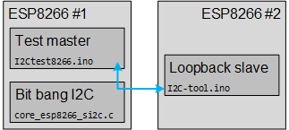

# I2C-tool
This github project contains two Arduino sketches aiming at testing I2C communication.

## Introduction
The first sketch [I2C-tool](I2C-tool) is the key one. 
It is an ESP8266 firmware implementing an I2C slave with spy, loop-back and configurable clock stretch injector.

The second sketch [I2Ctest8266](I2Ctest8266) is a test sketch.
It tests the I2C master implementation (bit bang driver) of ESP8266.

## Test setup
The two sketches each run on an ESP8266 in a following setup.

Sketch `I2Ctest8266.ino` runs on ESP8266 number 1, mastering I2C transactions to ESP8266 number 2.
ESP8266 number 2 runs the `I2C-tool.ino` looping back messages send by ESP8266 number 1.

The goal is to test the ESP8266 I2C driver which comes with Arduino.
It is completely written in software ("bit bang").

